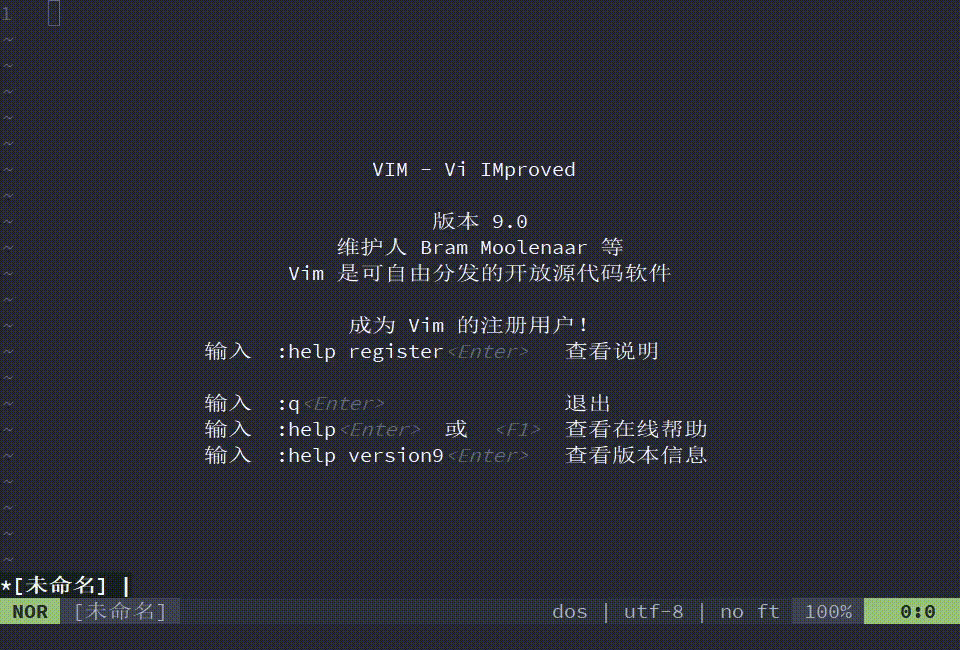
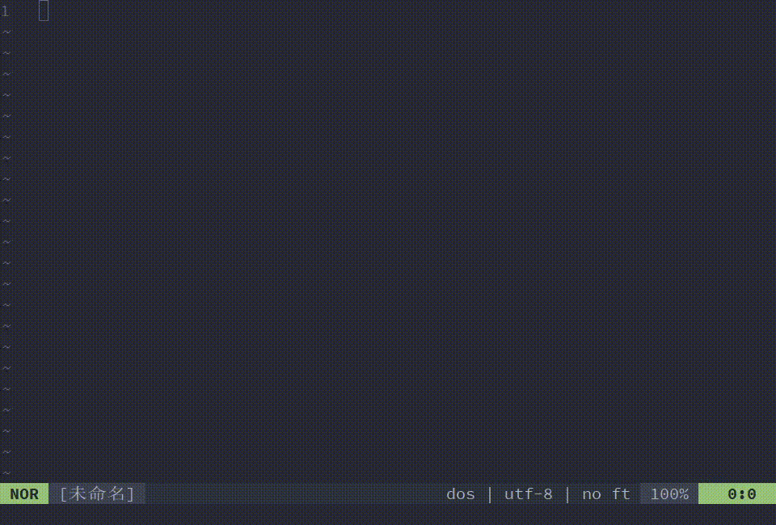
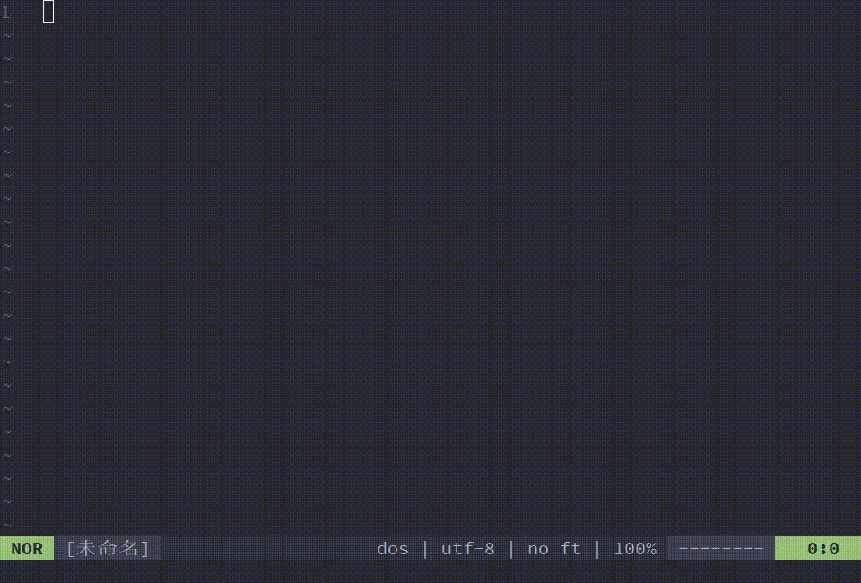

# boringBubble.vim

✨ A boring plugin for bored XD

>   echo BORING bubble string like **o 0 O** in vim coding.
>
>   Bubble will change when you coding.


💥 warning: This plugin may affect your programming efficiency

### Preview



### Installation

You can install it in your ways like other vim plugin.

If you have no experience in installing plugins, I recommend you install them using the method provided by the official vim documentation, it's very easy to install a vim plugin.

*   linux

    `cd` to your `~/.vim/pack/ANY/start` or`~/.vim/pack/ANY/opt` , then

    `git clone https://github.com/paradoxskin/boringBubble.vim.git`

*   windows

    `cd` to your vim's `$HOME/vimfiles/pack/ANY/start` or `$HOME/vimfiles/pack/ANY/opt`(you can find the `$HOME` path by `:echo $HOME`) ,then

    `git clone https://github.com/paradoxskin/boringBubble.vim.git`

### Usage

*   `g:boringBubble#len`, **length** of the Bubble String
*   `g:boringBubble#echo`, do you want to echo it ? 0 to disable and 1 to enable, default 1
*   `g:boringBubble#map`, must be a **string of length 4**, the Bubble characters you want to appear

For example, add it in your vimrc

```vim
let g:boringBubble#len=8
let g:boringBubble#map="-_-_"
```

it will be like:



*   You can get Bubble by `g:boringBubble#Bubble`. So it can also echoed in your status-line, I use [lightline.vim](https://github.com/itchyny/lightline.vim) 

    ```vim
    let g:lightline={'colorscheme':'one',
    		\ 'active': {
    		\	'right': [['lineinfo'],
    		\			  ['Bubble'],
    		\			  ['fileformat','fileencoding','filetype','percent']]
    		\ },
    		\ 'component': {
    		\ 	'Bubble': '%{g:boringBubble#Bubble}'
    		\ }
          \ }
          
    let g:boringBubble#len=8
    let g:boringBubble#echo=0
    let g:boringBubble#map="-*--"
    ```

    

    For pure:

    ```vim
    set statusline+=%{g:boringBubble#Bubble}
    ```


✨ ENJOY:D

​    

​    